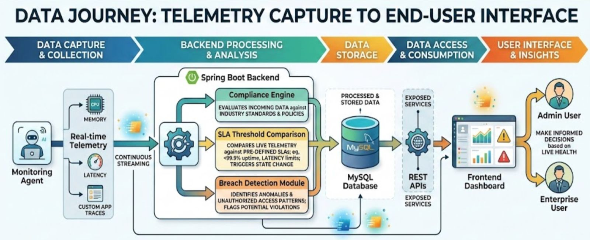

# SLA-Based Bandwidth Verification for ILL Services

A **real-time SLA monitoring platform** designed to verify Service Level Agreement (SLA) compliance for Internet Leased Line (ILL) services.
The system continuously captures telemetry data, evaluates SLA thresholds, detects breaches instantly, and provides a visual dashboard for monitoring network performance.

---

##  Features

* Real-time bandwidth and latency monitoring
* Automatic SLA compliance verification
* SLA breach detection and alerts
* Compliance percentage calculation
* REST API based backend services
* Interactive dashboard for visualization

---

##  System Architecture



The architecture follows a telemetry-driven pipeline where monitoring agents collect data, backend services analyze SLA compliance, and the frontend dashboard visualizes results.

---

##  Project Structure

```
SLA-Based-Bandwidth-Verification-for-ILL-Services
│
├── docs
│   └── architecture-diagram.png
│
├── sla-backend
│   ├── src
│   ├── pom.xml
│   └── Spring Boot application
│
├── sla-frontend
│   └── index.html
│
├── sla-monitor-agent
│   ├── monitor.py
│   └── config.json
│
└── README.md
```

---

##  Tech Stack

**Monitoring Agent**

* Python

**Backend**

* Java
* Spring Boot
* REST APIs

**Database**

* MySQL

**Frontend**

* HTML
* JavaScript
* Chart.js

---

##  Data Flow

1. The **Monitoring Agent** collects telemetry data such as bandwidth, latency, and system metrics.
2. Data is streamed to the **Spring Boot backend**.
3. The backend evaluates incoming data against **predefined SLA thresholds**.
4. Processed telemetry and compliance results are stored in the **MySQL database**.
5. **REST APIs** expose the processed data.
6. The **Frontend Dashboard** visualizes SLA compliance and network health.

---

##  Use Case

Internet Service Providers (ISPs) and enterprises using **Internet Leased Line connections** can use this platform to ensure that the promised bandwidth and performance metrics defined in their SLA are actually delivered.

---

##  Author

**Sai Ishita** , 
Computer Science Engineering , SRMIST

